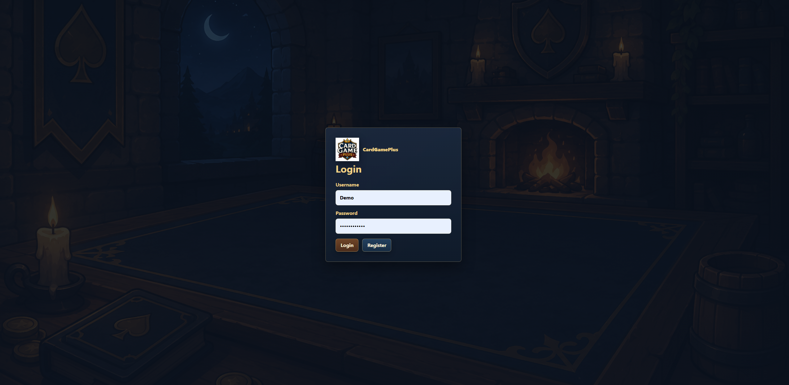
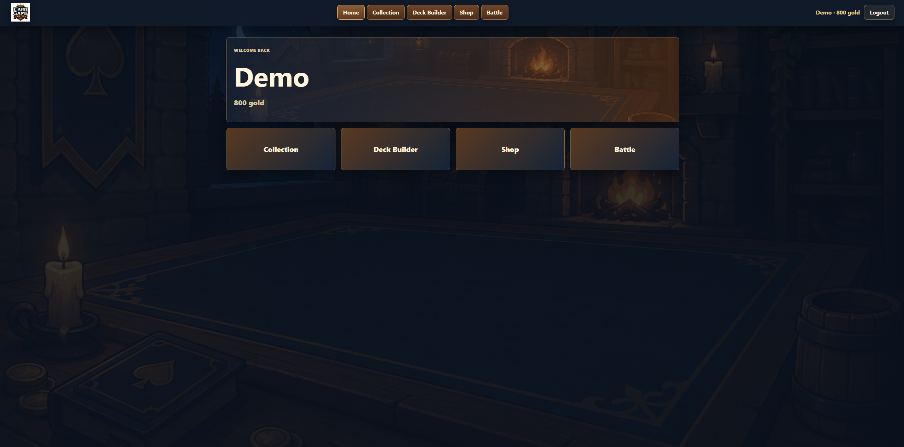
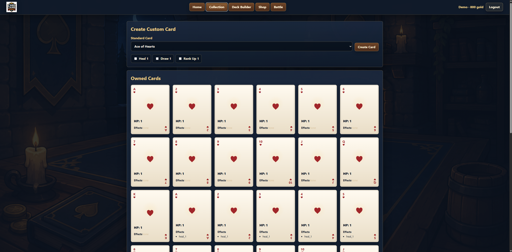
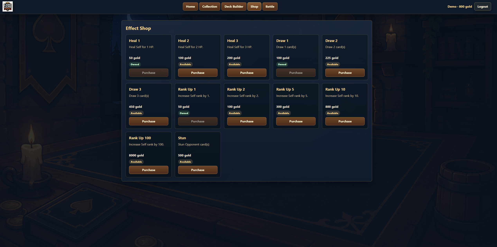
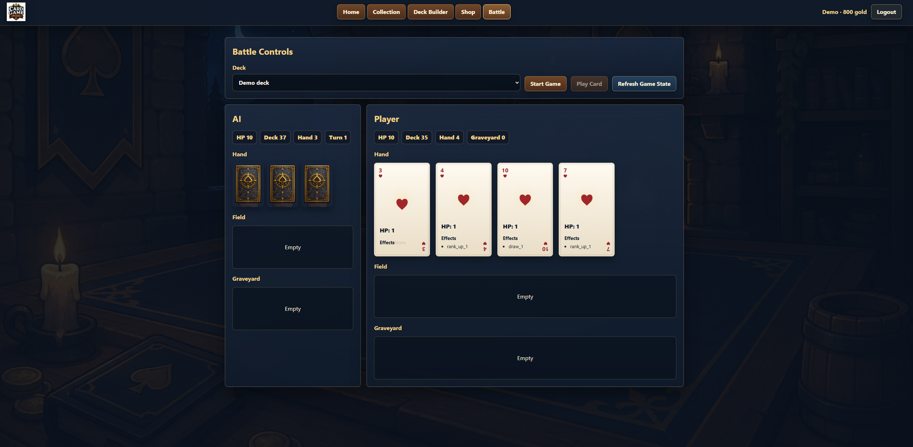

# CardGamePlus

CardGamePlus is a full-stack collectible card game built around a customizable, data-driven gameplay engine.

Players build unique decks by combining standard playing cards with permanently unlocked Effect templates, then battle against an AI opponent. The project demonstrates layered backend architecture, runtime object reconstruction, REST API design, authentication, and a modern React frontend.

---

# Live Demo

**Application**

>https://card-game-plus.vercel.app/login

### Demo Account

| Username | Password |
|----------|----------|
| `Demo` | `canihaveajob` |

The demo account includes:

- Starter card collection
- Playable deck
- Unlocked Effects
- Gold for testing the Shop

---

# Screenshots

<p align="center">
  
  
</p>

<p align="center">
  
  
</p>

<p align="center">
  
</p>

---

# Features

## Gameplay

- Customizable card system
- Data-driven Effect engine
- Turn-based battle system
- AI opponent
- Runtime gameplay engine
- Permanent player progression

## Backend

- FastAPI REST API
- JWT authentication
- Layered service architecture
- SQLAlchemy ORM
- Runtime object reconstruction
- SQLite development database
- PostgreSQL-ready architecture

## Player Systems

- User registration and login
- Card collection
- Deck builder
- Shop system
- Permanent Effect unlocks
- Gold rewards

---

# Tech Stack

## Backend

- Python
- FastAPI
- SQLAlchemy
- SQLite
- JWT Authentication
- Pydantic

## Frontend

- React
- TypeScript
- Vite

## Development

- Git
- GitHub
- PyCharm
- Swagger / OpenAPI

---

# Architecture

CardGamePlus follows a layered architecture that separates persistence from gameplay.

```
React Frontend
        │
        ▼
FastAPI Routers
        │
        ▼
Service Layer
        │
        ├──────────────┐
        ▼              ▼
Database         Runtime Objects
(SQLAlchemy)           │
        │              ▼
        └──────► GameEngine
                       │
                       ▼
                 EffectEngine
```

Gameplay operates entirely on runtime objects while persistent data remains isolated inside the database layer.

---

# Running Locally

## Backend

```bash
python -m venv .venv

# Windows
.venv\Scripts\activate

pip install -r requirements.txt

python -m uvicorn main:app --reload
```

Backend:

```
http://localhost:8000
```

Swagger API Documentation:

```
http://localhost:8000/docs
```

---

## Frontend

```bash
cd frontend

npm install

npm run dev
```

Frontend:

```
http://localhost:5173
```

---

# Documentation

Additional documentation is available in the `docs/` directory.

- Architecture
- Database Design
- Game Rules
- Development Log

---

# Project Status

## Completed

- ✅ React frontend
- ✅ FastAPI REST API
- ✅ JWT authentication
- ✅ SQLAlchemy database
- ✅ Runtime gameplay engine
- ✅ Data-driven Effect engine
- ✅ AI opponent
- ✅ Deck builder
- ✅ Card collection
- ✅ Shop system
- ✅ Persistent player progression

## Future Improvements

- Multiplayer
- Advanced AI
- Additional Effect templates
- Gameplay balancing
- Animations and visual polish

---

# Software Engineering Concepts Demonstrated

- Object-Oriented Programming
- Layered Architecture
- REST API Design
- Database Design
- Runtime Object Reconstruction
- Separation of Concerns
- Dependency Injection
- Data-Driven Game Systems

---

# License

This project is intended for educational and portfolio purposes.